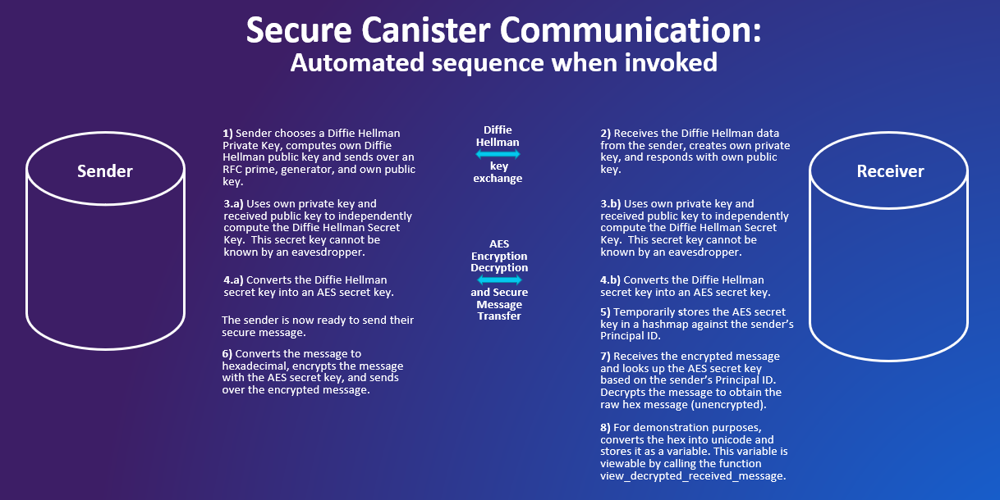

# Secure Canister Communication on the IC Blockchain
Submitted to the Supernova Hackathon by Cramium Inc.

## Summary

Data security is critical for technical business applications, especially when sensitive information like Personally Identifiable Information (PII) is part of the application.  Nearly all industries have PII as part of their business applications and it’s paramount that application developers take data security seriously and build in the necessary measures to mitigate risk. Examples of PII include: emails, phone numbers, addresses, passwords, device ids, ip addresses, and personal characteristics. 

We provide a framework where sensitive messages (such as PII) can be securely passed between canisters, i.e to avoid man-in-the-middle attacks. Our solution allows secrets to be securely communicated between canisters without being compromised by eavesdroppers. Such a solution does not yet exist as a project deployed on IC, and we therefore believe we are making important contribution towards the future of the IC, opening the possibilities to a wide range of business applications, which rely on secrets being securely transmitted.

Our solution comprises of a sender and a receiver. The sender and receiver perform a public key exchange to independently arrive at a secret AES key which cannot be known to an eavesdropper. The sender then sends AES encrypted data to the receiver which is then decrypted on the receiver's side.

<div align="center">
  <a>
    
  </a>
</div>

## Encryption Modules we built

We use the Diffie-Hellman key exchange together with AES-128. In order to implement our solution, we needed to build several original encryption modules modules in motoko:

* aes128.mo -- Implementation of the Symmetric encryption algorithm AES-128
* polynomial_handling.mo -- Mathematics module that handles Addition and Multiplication in Polynomial rings k[X]/(f). This is required for AES implementation, since multiplication operations in AES involve converting bytes to polynomials and multiplying the corresponding polynomials in k[X]/(f).
* diffiehellman.mo -- Helper functions to perform the Diffie Hellman Key Exchange
* converter.mo -- Handles conversions between binary, Nat8, hex, unicode etc..

The first three modules above are the first such modules implemented in Motoko. The fourth is a compilation of convenient conversion functions, most of which have not been implemented yet elsewhere. We believe we are making a significant contribution to the IC developer community by making these encryption modules public, since they are the first of their kind that has been implemented.

## How to run our solution

Choose your secret message that should be communicated securely. For this example, our message is "My secret password is FireWater45_1991". 

Now, run: 

 ```sh
dfx canister call sender send_secure_message '("My secret password is FireWater45_1991")'
```

Your debug output will look like this (i.e this will be printed out for demonstration purposes, in the console window where you ran "dfx start"):

 ```sh
[Canister rrkah-fqaaa-aaaaa-aaaaq-cai] Receiver: I have independently computed the AES secret key, and it is f882c3e88feeaad705db052c13cce66b
[Canister ryjl3-tyaaa-aaaaa-aaaba-cai] Sender: I have independently computed the AES secret key, and it is f882c3e88feeaad705db052c13cce66b
[Canister ryjl3-tyaaa-aaaaa-aaaba-cai] Sender: The raw hex data (before encryption) is 4d79207365637265742070617373776f72642069732046697265576174657234355f31393931
[Canister ryjl3-tyaaa-aaaaa-aaaba-cai] Sender: The encrypted message we are sending to the Receiver is 481b2a540f7503a5aa12248c812060d873d0e888862a7c0dc8fee4fb3fed2e329189c1ab8bbbeb2d93e4e9b43de9f228
[Canister rrkah-fqaaa-aaaaa-aaaaq-cai] Receiver: The encrypted message I have received is 481b2a540f7503a5aa12248c812060d873d0e888862a7c0dc8fee4fb3fed2e329189c1ab8bbbeb2d93e4e9b43de9f228
[Canister rrkah-fqaaa-aaaaa-aaaaq-cai] Receiver: The decrypted message using my AES secret key is: My secret password is FireWater45_1991
```

Basically, the debug output is telling us that:
* both the Receiver and Sender have independently computed the AES secret key, their keys match.
* The Sender has converted the secret message into hex, encrypted it, and sent the encrypted data to the Receiver
* The Receiver has received the correct encrypted data, and has decrypted it correctly as the original message

To further demonstrate that the message has been received successfully, you can run: 

 ```sh
dfx canister call receiver view_decrypted_received_message
```

This will return: ("My secret password is FireWater45_1991")

That is, the Receiver has decrypted the message successfully and stored it in a variable on that canister (for demonstration purposes) which is then being accessed.

## The big picture: Decentralization could prove to be a better than Centralization from a security perspective

With centralization, there is always a single point of failure, and a compromised technician or engineer working for the company who hosts and maintains the servers (e.g AWS) could pose a security risk for sensitive data. With decentralization, it is possible to spread your secrets across multiple servers and this could provide heightened security in the sense that the compromise of any single server would not divulge the secrets. Furthermore, data on the blockchain is not stored in tables which a malicious insider could read off/copy, but rather stored in variables, which is considerably more secure. However, for a credible decentralized security solution to take form, three things must be done:
* hardware protections (think enclaves) 
* caller screening
* secure communication

The first is on DFINITY's roadmap, The second can be easily implemented on the IC via Principal IDs. We have provided a solution to the third.
